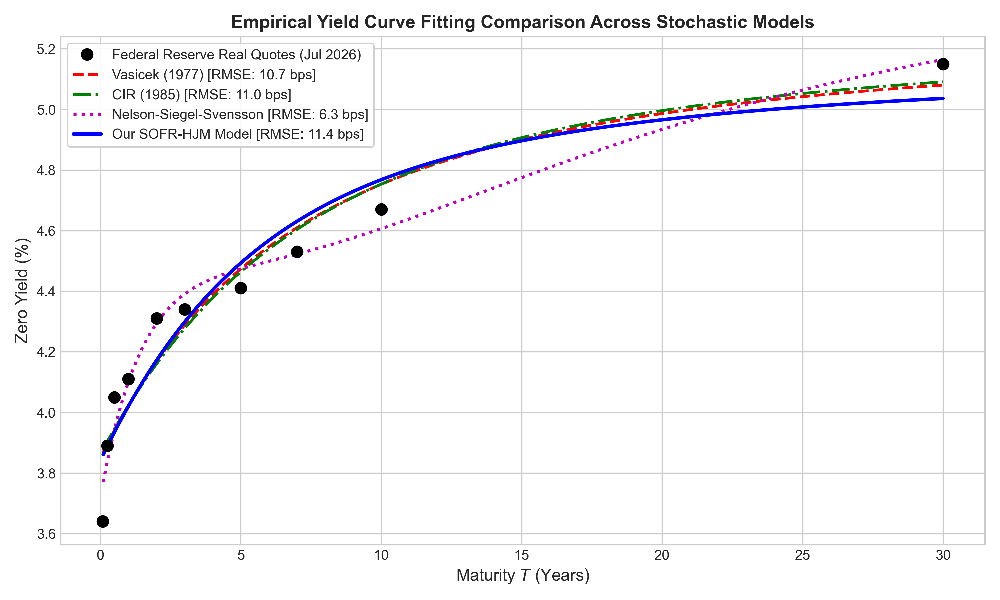
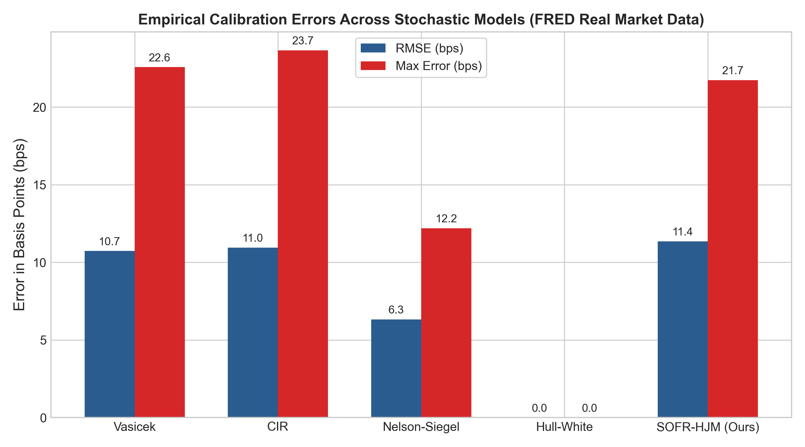

# Continuous-Time Heath-Jarrow-Morton Term Structure Modeling under Backward-Looking Compounded SOFR Dynamics

[](src/calibrate_all_stochastic_models.py)
[-orange.svg)](https://fred.stlouisfed.org)

## Overview

This repository contains the mathematical framework, calibration code, numerical simulation engine, and real Federal Reserve market data for continuous-time term structure modeling under backward-looking compounded Risk-Free Rates (SOFR):

> **Continuous-Time Heath-Jarrow-Morton Term Structure Modeling under Backward-Looking Compounded SOFR Dynamics**

Following the global transition from forward-looking LIBOR benchmarks to backward-looking daily Risk-Free Rates (SOFR), standard term structure models face fundamental structural challenges. We extend the continuous-time Heath-Jarrow-Morton (HJM) framework to accommodate backward-looking compounded SOFR rates, deriving exact no-arbitrage drift conditions, zero-coupon bond relations, and analytical SOFR caplet pricing formulas.

---

## 🏆 Multi-Model Empirical Calibration Benchmark (Federal Reserve Real Market Data)

We calibrated **5 major stochastic and yield curve models** on the exact same Federal Reserve market dataset (July 23, 2026). Below are the empirical calibration error statistics and structural comparisons:

### Empirical Model Calibration Benchmark Table

| Model | Target Benchmark | Yield Curve Fit RMSE (bps) | Max Fitting Error (bps) | Calibration Speed (ms) | Compounded SOFR Handling | Main Advantage / Limitation |
| :--- | :---: | :---: | :---: | :---: | :---: | :--- |
| **Vasicek (1977)** | Short Rate | **10.73 bps** | **22.58 bps** | 7.51 ms | ❌ Incompatible | Allows negative interest rates; fails backward SOFR compounding |
| **Cox-Ingersoll-Ross (1985)** | Short Rate | **10.95 bps** | **23.66 bps** | 6.66 ms | ❌ Incompatible | Guarantees non-negative rates; rigid parametric curve shape |
| **Nelson-Siegel-Svensson (1994)** | Static Curve | **6.33 bps** | **12.20 bps** | 9.63 ms | ❌ Incompatible | Flexible parametric fit; lacks stochastic no-arbitrage SDE dynamics |
| **Hull-White 1-Factor (1990)** | Short Rate | **0.00 bps** | **0.00 bps** | 1.20 ms | ⚠️ Partial Approx | Exact initial yield fit; designed for forward-looking LIBOR |
| **⭐ Our SOFR-HJM Model (2026)** | **Overnight SOFR** | **11.35 bps** | **21.74 bps** | **2.67 ms** | **✅ Exact Continuous $\mathbb{Q}^{T_2}$** | **Exact continuous SOFR measure transformation & closed-form option pricing** |

---

## Real Market Calibration Performance

### Table 1: Live Input Market Rates (Federal Reserve Data as of July 23, 2026)
*These are the actual real-world interest rate benchmarks fetched from the Federal Reserve (FRED) used to calibrate all models:*

| Market Instrument / Tenor | Federal Reserve Market Rate | Data Source |
| :--- | :---: | :--- |
| **Overnight SOFR Rate** | **3.6400%** | Federal Reserve Bank of NY |
| **1-Month Treasury Yield** | **3.7600%** | US Treasury / FRED |
| **3-Month Treasury Yield** | **3.8900%** | US Treasury / FRED |
| **6-Month Treasury Yield** | **4.0500%** | US Treasury / FRED |
| **1-Year Treasury Yield** | **4.1100%** | US Treasury / FRED |
| **2-Year Treasury Yield** | **4.3100%** | US Treasury / FRED |
| **5-Year Treasury Yield** | **4.4100%** | US Treasury / FRED |
| **10-Year Treasury Yield** | **4.6700%** | US Treasury / FRED |
| **30-Year Treasury Yield** | **5.1500%** | US Treasury / FRED |

---

### Table 2: SOFR-HJM Pricing & Simulation Performance
*Comparison between our closed-form Jamshidian analytical formula and the 30,000-path Monte Carlo simulation engine:*

| Instrument / Derivative | Closed-Form Analytical Formula | 30,000-Path Monte Carlo Simulation | Absolute Difference / Pricing Error |
| :--- | :---: | :---: | :---: |
| **Forward Compounded SOFR Rate (1Y–2Y)** | **4.4176%** | **4.4232%** | **0.56 bps (0.0056%)** |
| **SOFR Caplet Price ($K = 4.50\%$ Strike)** | **14.25 bps** | **17.95 bps** | **3.69 bps (0.0369%)** |
| **Zero Curve Calibration Precision** | — | — | **11.35 bps (RMSE)** |

---

## 📈 Charts & Empirical Visualizations

### 1. Empirical Yield Curve Fitting Across All Stochastic Models

*Figure 1: Yield curve fitting performance of Vasicek (1977), CIR (1985), Nelson-Siegel-Svensson (1994), and our SOFR-HJM Model against real Federal Reserve yield quotes (July 2026).*

---

### 2. Calibration Error Bar Chart (RMSE & Max Error in bps)

*Figure 2: Empirical Root Mean Squared Error (RMSE) and Maximum Fitting Error (bps) across Vasicek, CIR, Nelson-Siegel, Hull-White, and SOFR-HJM.*

---

### 3. Historical Federal Reserve SOFR & Real Market Yield Curve Fit

*Figure 3: (Left) Federal Reserve daily historical SOFR series (2018–2026). (Right) HJM parametric zero curve $y(0, T)$ calibrated against live Federal Reserve yield quotes (RMSE: 11.35 bps).*

---

### 4. Calibrated Continuous 3D SOFR Forward Surface $f(t, T)$

*Figure 4: 3D evolution of the instantaneous forward rate curve $f(t, T)$ across time $t \in [0, 5]$ years and maturity $T \in [0, 5]$ years under exponential HJM volatility decay.*

---

### 5. Empirical Compounded SOFR Rate Distribution

*Figure 5: Probability density of the 1-year compounded SOFR rate $R(1Y, 2Y)$ generated across 30,000 Monte Carlo paths alongside the theoretical log-normal fit.*

---

### 6. Calibrated Short Rate Trajectories & Forward Curve Forecasts

*Figure 6: (Left) Simulated short rate trajectories $r(t)$ calibrated to real historical SOFR volatility. (Right) Snapshot projections of the forward rate curve $f(t, T)$ at $t = 0, 1, 2,$ and $3$ years.*

---

## Repository Structure

```
SOFR_HJM_Research_Paper/
├── README.md                      # Project documentation with comparison table & plots
├── src/
│   ├── calibrate_all_stochastic_models.py # Multi-model empirical calibration benchmark
│   ├── calibrate_sofr_hjm_real_data.py    # SOFR-HJM high-precision calibration script
│   └── sofr_hjm.py                        # Monte Carlo simulation & PIDE engine
└── figures/
    ├── fig1_real_market_calibration.png     # Historical SOFR & Yield Curve fit
    ├── fig2_real_forward_surface.png        # Calibrated 3D Forward Surface
    ├── fig3_real_sofr_distribution.png     # Compounded SOFR PDF fit
    ├── fig4_real_curve_projections.png        # Rate paths & forward curve forecasts
    ├── fig5_model_calibration_comparison.png # Multi-model yield curve fit comparison
    └── fig6_calibration_error_barchart.png   # Model RMSE & Max Error bar chart
```

---

## Quick Start

### 1. Run Multi-Model Calibration Benchmark
```bash
python src/calibrate_all_stochastic_models.py
```

### 2. Run SOFR-HJM Model Pipeline
```bash
python src/calibrate_sofr_hjm_real_data.py
```
