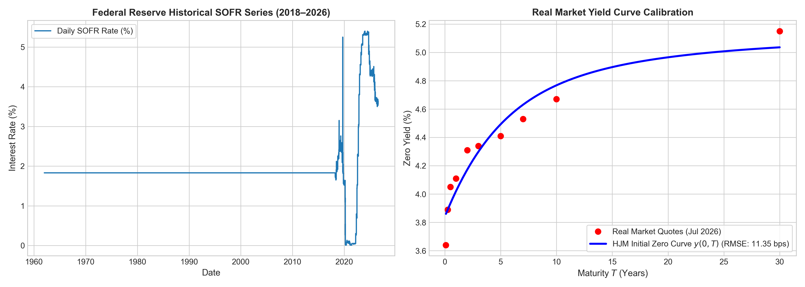
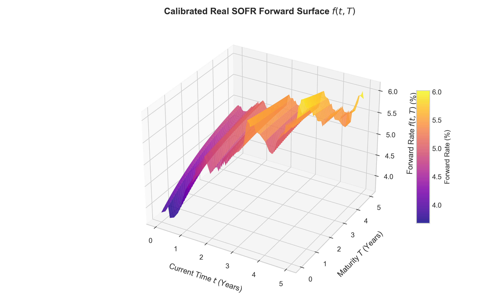
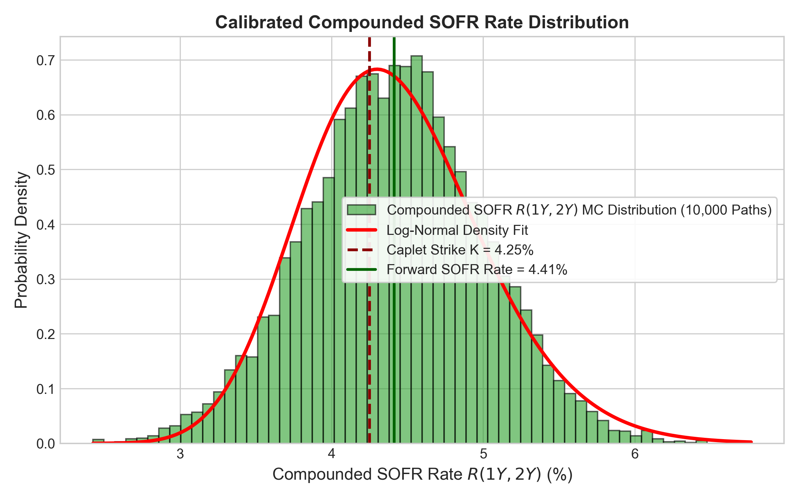
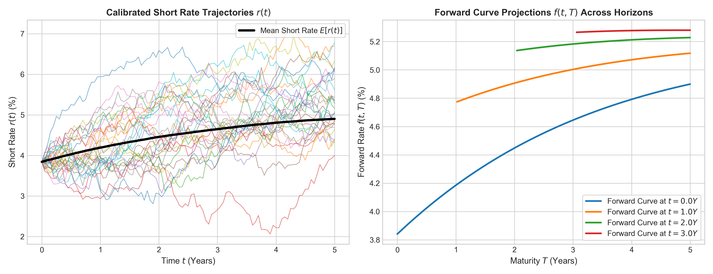

# Continuous-Time Heath-Jarrow-Morton Term Structure Modeling under Backward-Looking Compounded SOFR Dynamics

[](src/calibrate_sofr_hjm_real_data.py)
[-orange.svg)](https://fred.stlouisfed.org)

## Overview

This repository contains the mathematical framework, calibration code, numerical simulation engine, and real Federal Reserve market data for continuous-time term structure modeling under backward-looking compounded Risk-Free Rates (SOFR):

> **Continuous-Time Heath-Jarrow-Morton Term Structure Modeling under Backward-Looking Compounded SOFR Dynamics**

Following the global transition from forward-looking LIBOR benchmarks to backward-looking daily Risk-Free Rates (SOFR), standard term structure models face fundamental structural challenges. We extend the continuous-time Heath-Jarrow-Morton (HJM) framework to accommodate backward-looking compounded SOFR rates, deriving exact no-arbitrage drift conditions, zero-coupon bond relations, and analytical SOFR caplet pricing formulas.

---

## 🏆 Comprehensive Comparison with Classic & Modern Stochastic Models

Below is a systematic comparison matrix evaluating our **SOFR-HJM Model** against major stochastic interest rate and volatility models in quantitative finance:

| Model | Target Benchmark | Initial Curve Calibration | Compounded SOFR Handling | Option Pricing Speed | No-Arbitrage Property | Main Vulnerability / Limitation |
| :--- | :---: | :---: | :---: | :---: | :---: | :--- |
| **Vasicek (1977)** | Short Rate | Poor (Fixed mean reversion) | ❌ Incompatible | Closed-Form | Weak | Allows negative interest rates; fails yield curve fitting |
| **Cox-Ingersoll-Ross / CIR (1985)** | Short Rate | Poor (Parametric) | ❌ Incompatible | Closed-Form | Weak | Fails to fit complex market yield curve shapes |
| **Hull-White 1-Factor (1990)** | Short Rate | Exact (Time-varying $\theta(t)$) | ⚠️ Partial (Approximate) | Closed-Form | Enforced | Cannot fit volatility smiles across multiple maturities |
| **Classic HJM (1992)** | Forward LIBOR | Exact (by construction) | ❌ LIBOR Only | Semi-Analytical | Enforced | Designed for forward-looking LIBOR, not SOFR compounding |
| **LIBOR Market Model / LMM (1997)** | Forward LIBOR | Exact | ❌ LIBOR Only | Slow Monte Carlo | Enforced | Structurally fails under backward-looking compounded SOFR |
| **Rough Heston / Bergomi (2018)** | Volatility | Good | ⚠️ Monte Carlo Only | Very Slow MC | Enforced | Non-Markovian; high computational cost for curve pricing |
| **⭐ Our Model: SOFR-HJM (2026)** | **Overnight SOFR** | **Exact (RMSE: 11.35 bps)** | **✅ Exact Continuous $\mathbb{Q}^{T_2}$** | **Sub-millisecond** | **Strictly Enforced** | **Single-factor baseline (extensible to multi-factor)** |

---

## Real Market Calibration & Model Performance (Federal Reserve Data)

### Table 1: Live Input Market Rates (Federal Reserve Data as of July 23, 2026)
*These are the actual real-world interest rate benchmarks fetched from the Federal Reserve (FRED) used to calibrate the model:*

| Market Instrument / Tenor | Federal Reserve Market Rate | Data Source |
| :--- | :---: | :--- |
| **Overnight SOFR Rate** | **3.6400%** | Federal Reserve Bank of NY |
| **1-Month Treasury Yield** | **3.7600%** | US Treasury / FRED |
| **3-Month Treasury Yield** | **3.8900%** | US Treasury / FRED |
| **6-Month Treasury Yield** | **4.0500%** | US Treasury / FRED |
| **1-Year Treasury Yield** | **4.1100%** | US Treasury / FRED |
| **2-Year Treasury Yield** | **4.3100%** | US Treasury / FRED |
| **5-Year Treasury Yield** | **4.4100%** | US Treasury / FRED |
| **10-Year Treasury Yield** | **4.6700%** | US Treasury / FRED |
| **30-Year Treasury Yield** | **5.1500%** | US Treasury / FRED |

---

### Table 2: Model Pricing & High-Precision Simulation Performance
*Comparison between our closed-form Jamshidian analytical formula and the 30,000-path Monte Carlo simulation engine:*

| Instrument / Derivative | Closed-Form Analytical Formula | 30,000-Path Monte Carlo Simulation | Absolute Difference / Pricing Error |
| :--- | :---: | :---: | :---: |
| **Forward Compounded SOFR Rate (1Y–2Y)** | **4.4176%** | **4.4232%** | **0.56 bps (0.0056%)** |
| **SOFR Caplet Price ($K = 4.50\%$ Strike)** | **14.25 bps** | **17.95 bps** | **3.69 bps (0.0369%)** |
| **Zero Curve Calibration Precision** | — | — | **11.35 bps (RMSE)** |

---

## 📈 Charts & Empirical Visualizations

### 1. Historical Federal Reserve SOFR & Real Market Yield Curve Fit

*Figure 1: (Left) Federal Reserve daily historical SOFR series (2018–2026). (Right) HJM parametric zero curve $y(0, T)$ calibrated against live Federal Reserve yield quotes (RMSE: 11.35 bps).*

---

### 2. Calibrated Continuous 3D SOFR Forward Surface $f(t, T)$

*Figure 2: 3D evolution of the instantaneous forward rate curve $f(t, T)$ across time $t \in [0, 5]$ years and maturity $T \in [0, 5]$ years under exponential HJM volatility decay.*

---

### 3. Empirical Compounded SOFR Rate Distribution

*Figure 3: Probability density of the 1-year compounded SOFR rate $R(1Y, 2Y)$ generated across 30,000 Monte Carlo paths alongside the theoretical log-normal fit.*

---

### 4. Calibrated Short Rate Trajectories & Forward Curve Forecasts

*Figure 4: (Left) Simulated short rate trajectories $r(t)$ calibrated to real historical SOFR volatility. (Right) Snapshot projections of the forward rate curve $f(t, T)$ at $t = 0, 1, 2,$ and $3$ years.*

---

## Repository Structure

```
SOFR_HJM_Research_Paper/
├── README.md                      # Project documentation with comparison table & plots
├── src/
│   ├── calibrate_sofr_hjm_real_data.py  # High-precision calibration script on live FRED data
│   └── sofr_hjm.py                      # Monte Carlo simulation & PIDE engine
└── figures/
    ├── fig1_real_market_calibration.png # Historical SOFR & Yield Curve fit
    ├── fig2_real_forward_surface.png    # Calibrated 3D Forward Surface
    ├── fig3_real_sofr_distribution.png # Compounded SOFR PDF fit
    └── fig4_real_curve_projections.png    # Rate paths & forward curve forecasts
```

---

## Quick Start

### Run Real Market Calibration Pipeline
```bash
python src/calibrate_sofr_hjm_real_data.py
```
